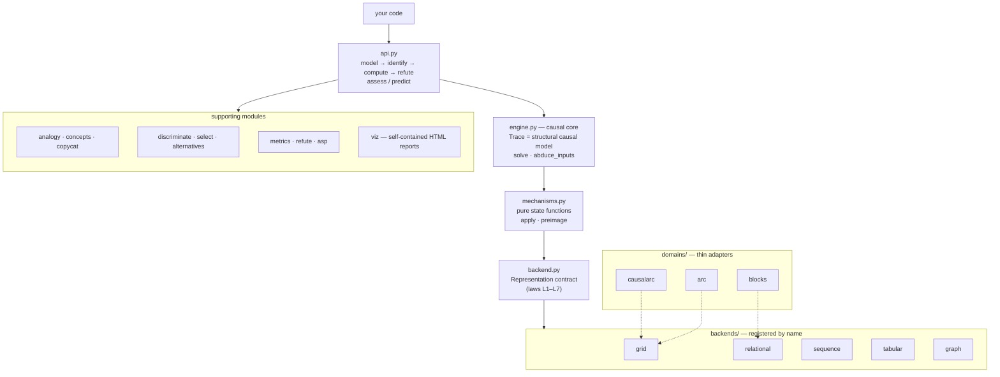

# twinworld

## What this is

`twinworld` is a Python library for counterfactual reasoning and explanation over symbolic
state-transition traces. It exposes a [DoWhy](https://github.com/py-why/dowhy)-style staged API
(`model → identify → compute → refute`), but the underlying model is a deterministic symbolic
solver, so counterfactuals are point-identified certificates rather than statistical estimates.
The solving core is non-connectionist — no neural nets or LLMs in the solving path. This is part
of a PhD project; module docstrings reference the thesis experiments they support.

First domain: the [ARC challenge](https://github.com/fchollet/ARC-AGI). Neural components can
plug in later through the backend registry without touching the core.

## Architecture



The staged verbs in `api.py` drive the causal core in `engine.py`, where a `Trace` of states
connected by pure `Mechanism` applications *is* the structural causal model. The core touches
state only through the `Representation` contract in `backend.py`, so the same pipeline runs
unchanged on all five backends; domain plugins adapt a real problem onto a backend by supplying
perception and a primitive vocabulary.

## Installation

```bash
pip install twinworld           # core: pure Python + networkx, no datasets
pip install 'twinworld[arc]'    # + the bundled ARC corpus via arckit (~16 MB)
pip install 'twinworld[asp]'    # + the clingo ASP solver backend
```

Requires Python ≥ 3.11. The core installs no data; the ARC corpus arrives only
with the `arc` extra, and the GPL-licensed CausalARC evaluation set is never
distributed — `twinworld.domains.causalarc` fetches it at runtime into
`~/.cache/twinworld` when you ask for it.

## Pipeline

```python
import twinworld

rep = twinworld.model(task)                      # fit under every abstraction; shortest program wins
query = twinworld.Interventional(step=1, alternative=...)
identified = twinworld.identify(rep, query)      # structural well-posedness check
cfs = twinworld.compute(identified)              # twin-world counterfactuals + per-item metrics
report = twinworld.refute(rep)                   # placebo-intervention battery

# segmentation is a recorded, revisable decision — so it is intervenable too:
twinworld.compute(twinworld.identify(rep, twinworld.Representational("mcc")))

# contrastive: why this outcome and not that one? Answered by the smallest
# program-edit set reaching the foil — CERTIFIED minimal (search is exhaustive
# per k) — or by a certificate that the foil is unreachable, with a
# Chockler-Halpern responsibility profile over the program's steps.
cfs = twinworld.compute(twinworld.identify(rep, twinworld.Contrastive(foil_grid, on="test[0]")))
cfs.responsibility  # e.g. {0: 0.5, 1: 0.5}
```

Because the domain is deterministic, counterfactual claims here are **certificates,
not estimates** — validated on a generated benchmark whose latent programs are
known by construction (100% recovery, minimality gap 0). And programs that fit
the demonstrations but are not behaviourally unique are detected *before* the
test pair is consulted: `twinworld.discriminate.diagnose` groups all fitting
programs into counterfactual-probe equivalence classes and exhibits the probe
on which they part ways.

The generality claim is substantiated, not asserted: `twinworld.domains.blocks`
runs the identical core on **blocks world** — the canonical STRIPS planning
domain — **natively, on a relational representation backend** (tower states
with unbounded columns; no grid in the pipeline), where the domain supplies
only a `MoveBlock` primitive with real preconditions and gravity (the same
move displaces a block differently in different states, provably
inexpressible as a translation rule). Contrastive plan edits, pertinent
negatives (clearance and landing-height presuppositions), necessity analysis,
and determinism diagnosis all work unchanged (`examples/blocks_world.py`),
and the historical grid serialization is kept as a **τ-abstraction
cross-check**: native and serialized runs must commute
(`tests/test_blocks_tau.py`, after Beckers & Halpern).

Two further solving strategies complement analogy: `model(induction="asp")`
hands the program search to **clingo** — choice rules over (selector,
transform) steps with negation-as-failure in the search space, object
dynamics as ASP rules, and every answer set verified through the exact
engine (ASP proposes, the engine disposes; the solid/separated-object
fragment is declared, and fragment mismatches are counted, never accepted).
And `twinworld.assess` / `twinworld.predict` turn underdetermination diagnosis into
a **confidence gate**: hypotheses that fit the demonstrations are grouped
into behavioural classes and applied to the test input — one class (or
unanimity) gates high, disagreement gates low and `predict` abstains with the
alternatives. The gate never sees the test output.

Whether counterfactual discrimination actually improves test accuracy on
failure class 3 — the proposal's most testable hypothesis — is now measured
(`examples/discrimination_report.py`, controlled ambiguous tasks where
Largest ≡ ByColour on every demonstration and the readings part ways on the
held-out test). **Passively**, no selection policy (`twinworld.select`: first /
random / shortest / largest-class / probe-stability / fewest-absences) beats
the pre-registered 50% ceiling on the symmetric collision (measured 0.40–0.57
over 30 instances), and in a declared colour-favoured world only prior-aligned
policies reach 0.70 — so the gate's calibrated abstention (30/30 answered with
zero errors on benign ambiguity) remains the library default. **Actively**,
the picture flips: answering the single diagnosing probe that
`twinworld.discriminate` exhibits lifts accuracy from 16/30 to **30/30 with one
query**, while the same query spent on a random extra demonstration reaches
only 27/30 and fails to break the collision 14/30 times — counterfactual
discrimination improves test accuracy exactly when it can *ask*, because the
probe is chosen where the hypotheses part ways. On the real corpus the sole
LOW specimen (b230c067) defeats every policy: none of its three fitted classes
contains the true behaviour — on real ARC, failure class 3 co-occurs with
class 1 (vocabulary incompleteness), and no selection can fix what induction
never proposed.

Abduction now runs backwards through *deletions*: `Delete` preimages enumerate
a bounded hypothesis space over what could have been erased (small shapes,
selector-pinned colours, separated placements), each candidate verified by
exact re-application, and `twinworld.engine.abduce_inputs` chains preimages
right-to-left — the proposal's "time travel backwards", working through
non-invertible steps. How that enumeration scales is measured, not guessed
(`examples/abduction_scaling.py`, ground-truth instances): the historical
anchor cap made most true origins **hard-unreachable** on large grids (a
top-left bias — recall collapsed by 20×20 and ×4 budgets did not help), so
single-object hypotheses now stream over every free cell and the true
pre-state is always findable at a rank that grows with
|free cells| × |shapes| × |pinned colours| — the honest law. Two-object truths
still trail every single-object world (Occam orders smallest-first, and pairs
stay capped via the explicit `PreimageBudget`), and backward chains need the
per-layer limit to cover the frontier (recovery saturates at limit 256): both
walls are documented in the report, not hidden.

Validation against causal ground truth is measured, not assumed
(`examples/causal_validation.py`): on latent-SCM tasks the Pearl-ladder
agreement is exact where induction recovers the latent program (L2: 27/27),
and every disagreement is observational equivalence failing to survive
interventions — underdetermination, not engine error. The
[CausalARC](https://huggingface.co/datasets/jmaasch/causal_arc) benchmark
(Maasch et al. 2025) loads through `twinworld.domains.causalarc` (runtime-fetched
evaluation data, GPL — never vendored, SCM sources never executed), and a
local-LLM baseline (`twinworld.baselines.llm`, any OpenAI-compatible endpoint)
supports the head-to-head and CausalARC's counterfactual-feedback setting
(`examples/llm_baseline.py`).

Negation runs through the library three ways (thesis Experiment 4): `Not(...)`
selectors in the rule language ("recolour everything *except* the largest" —
which solved an ARC task no positive selector could, at the measured cost of
more underdetermined fits); `twinworld.PertinentNegative` — what must be minimally
*absent* for the outcome to hold, answered with catalogue-bounded certificates
(and doubling as a discriminator: fragile size-based hypotheses have absence
dependencies that colour-based ones lack); and an optional ASP cross-check
(`pip install twinworld[asp]`) where clingo re-derives every selector under
negation-as-failure and must agree with the Python semantics.

Three abstraction schemes ship today (`cc4`, `cc8`, `mcc` — colour-blind composites);
on the 1000-task ARC training corpus no single scheme explains more than 22.5% of
tasks as pure object transformations, but the union reaches 32.6% — plural,
revisable segmentation is load-bearing, not a luxury.

Search is analogy-first: SME-style structure mapping between each train pair's
object graphs yields per-object deltas, deltas generalize across pairs into
candidate object rules (selector + transform), and the engine merely *verifies*
them — analogy proposes, search disposes. On tasks it solves, the analogy path
tries a median of ~1 program where blind enumeration tried hundreds, and
train-fitting programs that fail the held-out test are reported as
*underdetermined*, not solved — that gap is a research target, not noise.

The concept network behind that machinery is now **data, not code**
(`twinworld.concepts`): `learn_concepts` estimates the attribute weights, five
per-relation weights, and slippage probabilities from a corpus using
leave-one-attribute-out anchoring (colour statistics only from shape-anchored
correspondences and vice versa — never circular), and `ConceptNet` carries
them as a JSON-serializable artifact (`docs/learned-concepts.json`). Learned
from the 1000 ARC training tasks, the numbers overturn the hand-coded
intuitions — shape is the *least* reliable attribute (weight 4.0 → 0.27; true
correspondences change shape 42% of the time) while location is far more
informative than assumed (1.0 → 2.82) — yet every known solve survives and
the learned rule-family priors cut median programs-tried from 2 to 1. A
second, Copycat-style correspondence backend (`twinworld.copycat`: temperature,
annealed repair, slippage licensed by the learned slips;
`model(mapper="copycat"|"both")`) answers the digest's compose-or-compete
question empirically: on this corpus at this vocabulary they **coincide** —
identical solves, no union gain — and the held-out 120-task ARC-AGI-2 eval
set fits 0/120 under every configuration: the wall is the rule vocabulary,
not the weights (`examples/concept_report.py`).

Research grounding and full citations: [docs/research-digest.md](docs/research-digest.md).

## Visualization

Every stage of the pipeline renders to a single self-contained HTML page (pure
stdlib, zero dependencies): demonstrations with the held-out prediction,
plural segmentations with object outlines, state-by-state solving traces,
per-step interventional forks with diff-marked outcomes, pertinent negatives,
counterfactual re-segmentation, the confidence gate and the refutation battery.

```bash
python examples/visual_report.py a79310a0 --open   # write + open one report
python examples/visual_report.py --blocks --open   # blocks world, no arckit needed
python -m twinworld.viz                               # browse ARC at http://127.0.0.1:8008
                                                   # (tasks fit on first click, cached;
                                                   #  --scan pre-fits all at startup)
```

From code: `twinworld.viz.full_report(task) -> str` (pass `foil=` for a contrastive
section), plus `save_report`, `show`, and the grid/state/trace renderers for
composing custom pages. Works on any `Task`; only the corpus server needs the
`arc` extra. Most ARC tasks are outside the current rule vocabulary — the index
links known-fitting starters and marks fit status as you browse, and a no-fit
page still shows the demonstrations and segmentations (the honest corpus rate,
not an error).

## Using twinworld in your own domain

The core dispatches through a **representation backend** registry
(`twinworld.backend.Representation`): the engine trusts states for exactly one
hashable canonical `key` plus an entity/attribute ontology, so any
deterministic, fully-observable symbolic domain can plug in. **Five backends
ship today**: `"grid"` (ARC's 2D colour grids, ids 0–9, the default),
`"relational"` (STRIPS-style column worlds — blocks world runs natively:
[backends/relational.py](src/twinworld/backends/relational.py) +
[domains/blocks.py](src/twinworld/domains/blocks.py) are the worked template),
`"sequence"` (letter strings — Copycat's home domain, where rule induction
proposes "advance the rightmost letter" from abc→abd and Lewis & Mitchell's
counterfactual alphabets are ordinary interventions), `"tabular"` (feature
rows whose deterministic decision list IS the program — recourse what-ifs and
Rashomon-set diagnosis with certificates), and `"graph"` (labelled simple
graphs, where exhaustive one-edge sweeps answer the GNN explainers' question
with certainty). Each has a measured end-to-end example:

```bash
python examples/blocks_world.py       # relational: STRIPS plans, native
python examples/letter_strings.py     # sequence: abc -> abd + counterfactual alphabets
python examples/tabular_recourse.py   # tabular: decision-list recourse + Rashomon
python examples/graph_motifs.py       # graph: triangle motif + edge-edit certificates
```

Alternative sets from every query are uniformly rankable: `twinworld.Alternatives`
carries contrastive edit sets, preimage candidates, program classes and
pertinent-negative witnesses with named scores, `pareto_front` returns the
**exact** Pareto front (the sets are exhaustively enumerated — no NSGA-II
approximation), and `MetricVector` now carries `plausible`/`reachable`
certificates alongside validity/sparsity/proximity. A backend owes the core:

1. **perception & identity** — `parse(raw) → State` whose `key` is canonical
   (equality/hashing route through it; identity must not depend on the chosen
   segmentation), `canon(raw) → key`, a frame invariant, and entities exposing
   name-keyed `attributes`;
2. **mechanism primitives** — frozen dataclasses with `apply(state)`,
   `preimage(state, budget)` and an `exact_preimage` flag; real preconditions
   welcome (`MoveBlock` has clearance checks and gravity);
3. a **candidate generator** enumerating the task-scoped primitive vocabulary
   (`candidate_moves(task)`).

Optional capability hooks add probe generation, pertinent-negative
catalogues, placebo edits, a native distance, and HTML rendering — and
`twinworld.conformance_battery` checks the backend laws (L1–L7: parse/canon
agreement, abstraction-invariant identity, preimage soundness, rebuild
closure), so "supports twinworld" is a measured claim. Everything else comes
free and unchanged: program induction, twin-world interventions,
backtracking, certified-minimal contrastives, pertinent negatives, the
underdetermination gate, the refuters, and the visualization.

## Development

```bash
python3 -m venv .venv && ./.venv/bin/pip install -e '.[arc,dev]'
./.venv/bin/pytest
./.venv/bin/python examples/vertical_slice.py
```

Part of a PhD project on counterfactual explanations and analogy-making in symbolic AI.
